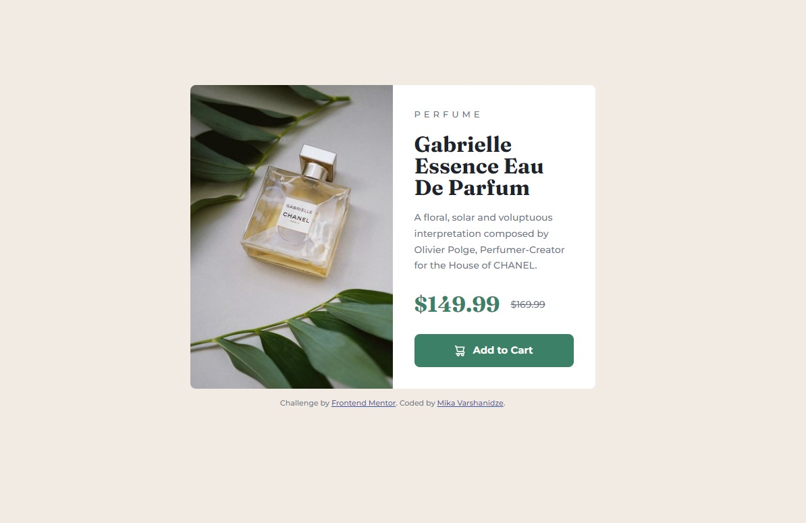

# Frontend Mentor - Product preview card component solution

This is a solution to the [Product preview card component challenge on Frontend Mentor](https://www.frontendmentor.io/challenges/product-preview-card-component-GO7UmttRfa). Frontend Mentor challenges help you improve your coding skills by building realistic projects. 

## Table of contents

- [Overview](#overview)
  - [The challenge](#the-challenge)
  - [Screenshot](#screenshot)
  - [Links](#links)
- [My process](#my-process)
  - [Built with](#built-with)
  - [What I learned](#what-i-learned)
- [Author](#author)

## Overview

### The challenge

Users should be able to:

- View the optimal layout depending on their device's screen size
- See hover and focus states for interactive elements

### Screenshot




### Links

- Solution URL: [Product Preview Card Component Solution](https://github.com/mikatechs/Product-preview-card-component)
- Live Site URL: [Product Preview Card Component Live site](https://mikatechs.github.io/Product-preview-card-component/)

## My process

- Used Kevin Powell's approach for this project. (https://www.youtube.com/watch?v=B2WL6KkqhLQ)

### Built with

- Semantic HTML5 markup
- CSS custom properties
- Flexbox
- CSS Grid
- Mobile-first workflow

### What I learned

As a newbie, I learned new HTML tags like (```<article>, <picture>, <source>```) and when to use them. General modern coding and styling approach.
Learned "sr-only" (Screen Reader) to hide information used for screen readers from the layout of a rendered page. CSS Custom reset.

```html
<article class="product">
  <picture class="product__img">
      <source srcset="./images/image-product-desktop.jpg" media="(min-width: 600px)">
          
  </picture>
</article>
```
```css
.visually-hidden:not(:focus):not(:active) {
    clip: rect(0 0 0 0);
    clip-path: inset(50%);
    height: 1px;
    overflow: hidden;
    position: absolute;
    white-space: nowrap;
    width: 1px;
}
```

## Author

- Website - [Mika Varshanidze](https://github.com/mikatechs/)
- Frontend Mentor - [@mikatechs](https://www.frontendmentor.io/profile/mikatechs)
- Facebook - [Mika Varshanidze](https://www.facebook.com/mikatechs)